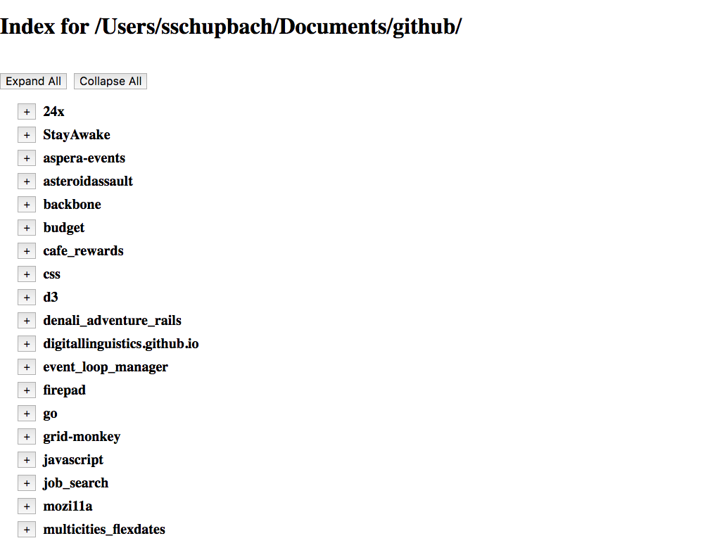
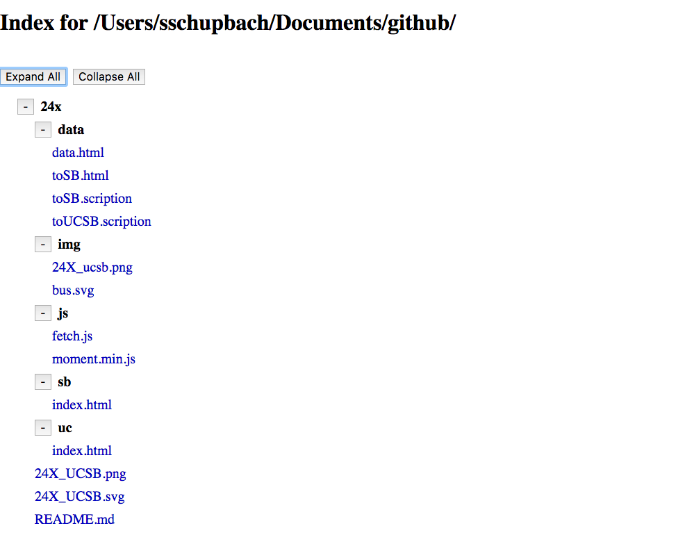
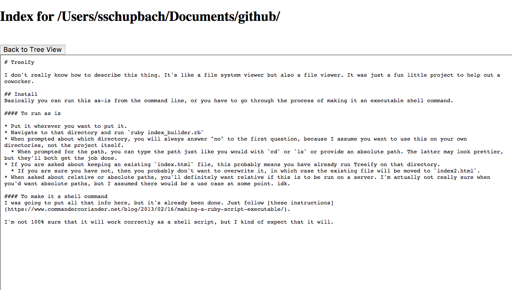
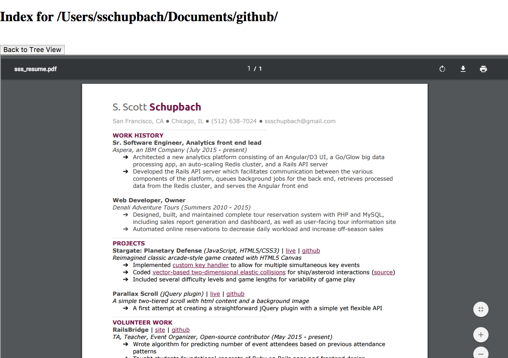

# Treeify

I don't really know how to describe this thing. It's like a file system viewer but also a file viewer that can be run in any directory on a server (which is accessible via browser) to make interaction with that directory more OS like. It was just a fun little project to help out a friend.

## Overview

Once the script has been run, you will have an `index.html` file in the root directory you selected. Opening that file in a browser you will see the collapsed tree-view of the directory.
<kbd>

</kbd>

To see more detail, you can click the `Expand All` button.
<kbd>

</kbd>

Clicking on a file opens the document view.
<kbd>

</kbd>

Because the document view is an `iframe`, files like PDFs will be displayed the same way your browser usually displays them without leaving the Treeify-generated index page.
<kbd>

</kbd>

## Install
Basically you can run this as-is from the command line, or you have to go through the process of making it an executable shell command.

#### To run as is

* Put it wherever you want to put it.
* Navigate to that directory and run `ruby index_builder.rb`
* When prompted about which directory, you will always answer "no" to the first question, because I assume you want to use this on your own directories, not the project itself.
  * When prompted for the path, you can type the path just like you would with `cd` or `ls` or provide an absolute path. The latter may look prettier, but they'll both get the job done.
* If you are asked about keeping an existing `index.html` file, this probably means you have already run Treeify on that directory.
  * If you are sure you have not, then you probably don't want to overwrite it, in which case the existing file will be moved to `index2.html`.
* When asked about relative or absolute paths, you'll definitely want relative if this is to be run on a server. I'm actually not really sure when you'd want absolute paths, but I assumed there would be a use case at some point. idk.

#### To make it a shell command
I was going to put all that info here, but it's already been done. Just follow [these instructions](https://www.commandercoriander.net/blog/2013/02/16/making-a-ruby-script-executable/).

I'm not 100% sure that it will work correctly as a shell script, but I kind of expect that it will.
